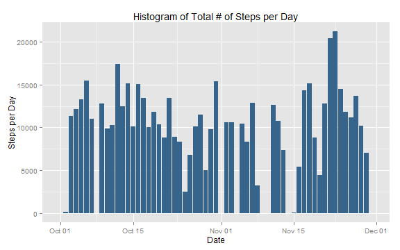
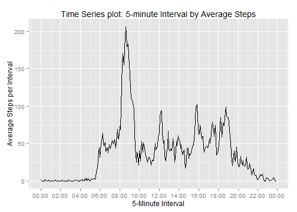
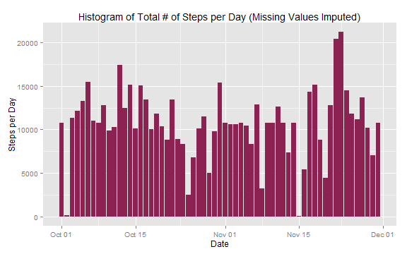
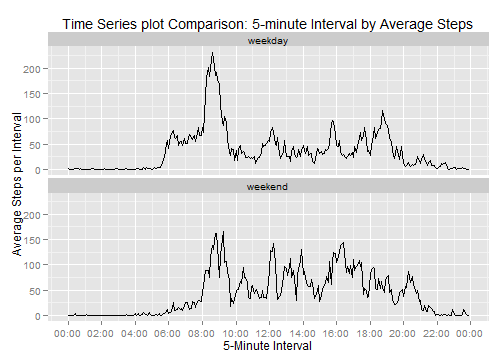

## Reproducible Research: Peer Assessment 1

### Loading and preprocessing the data
Load Libraries

```r
library(ggplot2)
library(xtable)
library(plyr)
library(scales)
```

To load the data, I unzip the activty folder and read in the actvitiy file. 
I also preprocessed the data by changing the class of the date and interval variables.


```r
unzip("activity.zip")
activity <- read.csv("activity.csv")
activity$date <- as.Date(activity$date,"%Y-%m-%d")
activity$interval <- as.POSIXct(sprintf("%04d",activity$interval), format= "%H%M")
activity$interval <- format(activity$interval, format="%H:%M")
```
### What is mean total number of steps taken per day?

#### 1. Make a histogram of the total number of steps taken each day

The count of steps per day is calculated to create a histogram of the total 
number of steps taken each day shown below.

```r
ActSum <- ddply(activity, .(date), summarise, StepTot = sum(steps, na.rm=T))
```

```r
ggplot(ActSum, aes(date, StepTot)) + 
	labs(x= "Date", y="Steps per Day") +
	geom_bar(stat="identity", fill="steelblue4") +
	ggtitle("Histogram of Total # of Steps per Day")
```

 

#### 2. Calculate and report the mean and median total number of steps taken per day


```r
ActCenter <- ddply(activity, .(date), summarise, 
					Step_Mean = round(mean(steps, na.rm=T),4),
					Step_Median = median(steps, na.rm=T))
ActCenter$date <- as.character(ActCenter$date)
print(xtable(ActCenter), type="html")
```

<!-- html table generated in R 3.0.3 by xtable 1.7-3 package -->
<!-- Sun Jun 15 10:14:15 2014 -->
<TABLE border=1>
<TR> <TH>  </TH> <TH> date </TH> <TH> Step_Mean </TH> <TH> Step_Median </TH>  </TR>
  <TR> <TD align="right"> 1 </TD> <TD> 2012-10-01 </TD> <TD align="right">  </TD> <TD align="right">  </TD> </TR>
  <TR> <TD align="right"> 2 </TD> <TD> 2012-10-02 </TD> <TD align="right"> 0.44 </TD> <TD align="right"> 0.00 </TD> </TR>
  <TR> <TD align="right"> 3 </TD> <TD> 2012-10-03 </TD> <TD align="right"> 39.42 </TD> <TD align="right"> 0.00 </TD> </TR>
  <TR> <TD align="right"> 4 </TD> <TD> 2012-10-04 </TD> <TD align="right"> 42.07 </TD> <TD align="right"> 0.00 </TD> </TR>
  <TR> <TD align="right"> 5 </TD> <TD> 2012-10-05 </TD> <TD align="right"> 46.16 </TD> <TD align="right"> 0.00 </TD> </TR>
  <TR> <TD align="right"> 6 </TD> <TD> 2012-10-06 </TD> <TD align="right"> 53.54 </TD> <TD align="right"> 0.00 </TD> </TR>
  <TR> <TD align="right"> 7 </TD> <TD> 2012-10-07 </TD> <TD align="right"> 38.25 </TD> <TD align="right"> 0.00 </TD> </TR>
  <TR> <TD align="right"> 8 </TD> <TD> 2012-10-08 </TD> <TD align="right">  </TD> <TD align="right">  </TD> </TR>
  <TR> <TD align="right"> 9 </TD> <TD> 2012-10-09 </TD> <TD align="right"> 44.48 </TD> <TD align="right"> 0.00 </TD> </TR>
  <TR> <TD align="right"> 10 </TD> <TD> 2012-10-10 </TD> <TD align="right"> 34.38 </TD> <TD align="right"> 0.00 </TD> </TR>
  <TR> <TD align="right"> 11 </TD> <TD> 2012-10-11 </TD> <TD align="right"> 35.78 </TD> <TD align="right"> 0.00 </TD> </TR>
  <TR> <TD align="right"> 12 </TD> <TD> 2012-10-12 </TD> <TD align="right"> 60.35 </TD> <TD align="right"> 0.00 </TD> </TR>
  <TR> <TD align="right"> 13 </TD> <TD> 2012-10-13 </TD> <TD align="right"> 43.15 </TD> <TD align="right"> 0.00 </TD> </TR>
  <TR> <TD align="right"> 14 </TD> <TD> 2012-10-14 </TD> <TD align="right"> 52.42 </TD> <TD align="right"> 0.00 </TD> </TR>
  <TR> <TD align="right"> 15 </TD> <TD> 2012-10-15 </TD> <TD align="right"> 35.20 </TD> <TD align="right"> 0.00 </TD> </TR>
  <TR> <TD align="right"> 16 </TD> <TD> 2012-10-16 </TD> <TD align="right"> 52.38 </TD> <TD align="right"> 0.00 </TD> </TR>
  <TR> <TD align="right"> 17 </TD> <TD> 2012-10-17 </TD> <TD align="right"> 46.71 </TD> <TD align="right"> 0.00 </TD> </TR>
  <TR> <TD align="right"> 18 </TD> <TD> 2012-10-18 </TD> <TD align="right"> 34.92 </TD> <TD align="right"> 0.00 </TD> </TR>
  <TR> <TD align="right"> 19 </TD> <TD> 2012-10-19 </TD> <TD align="right"> 41.07 </TD> <TD align="right"> 0.00 </TD> </TR>
  <TR> <TD align="right"> 20 </TD> <TD> 2012-10-20 </TD> <TD align="right"> 36.09 </TD> <TD align="right"> 0.00 </TD> </TR>
  <TR> <TD align="right"> 21 </TD> <TD> 2012-10-21 </TD> <TD align="right"> 30.63 </TD> <TD align="right"> 0.00 </TD> </TR>
  <TR> <TD align="right"> 22 </TD> <TD> 2012-10-22 </TD> <TD align="right"> 46.74 </TD> <TD align="right"> 0.00 </TD> </TR>
  <TR> <TD align="right"> 23 </TD> <TD> 2012-10-23 </TD> <TD align="right"> 30.97 </TD> <TD align="right"> 0.00 </TD> </TR>
  <TR> <TD align="right"> 24 </TD> <TD> 2012-10-24 </TD> <TD align="right"> 29.01 </TD> <TD align="right"> 0.00 </TD> </TR>
  <TR> <TD align="right"> 25 </TD> <TD> 2012-10-25 </TD> <TD align="right"> 8.65 </TD> <TD align="right"> 0.00 </TD> </TR>
  <TR> <TD align="right"> 26 </TD> <TD> 2012-10-26 </TD> <TD align="right"> 23.53 </TD> <TD align="right"> 0.00 </TD> </TR>
  <TR> <TD align="right"> 27 </TD> <TD> 2012-10-27 </TD> <TD align="right"> 35.14 </TD> <TD align="right"> 0.00 </TD> </TR>
  <TR> <TD align="right"> 28 </TD> <TD> 2012-10-28 </TD> <TD align="right"> 39.78 </TD> <TD align="right"> 0.00 </TD> </TR>
  <TR> <TD align="right"> 29 </TD> <TD> 2012-10-29 </TD> <TD align="right"> 17.42 </TD> <TD align="right"> 0.00 </TD> </TR>
  <TR> <TD align="right"> 30 </TD> <TD> 2012-10-30 </TD> <TD align="right"> 34.09 </TD> <TD align="right"> 0.00 </TD> </TR>
  <TR> <TD align="right"> 31 </TD> <TD> 2012-10-31 </TD> <TD align="right"> 53.52 </TD> <TD align="right"> 0.00 </TD> </TR>
  <TR> <TD align="right"> 32 </TD> <TD> 2012-11-01 </TD> <TD align="right">  </TD> <TD align="right">  </TD> </TR>
  <TR> <TD align="right"> 33 </TD> <TD> 2012-11-02 </TD> <TD align="right"> 36.81 </TD> <TD align="right"> 0.00 </TD> </TR>
  <TR> <TD align="right"> 34 </TD> <TD> 2012-11-03 </TD> <TD align="right"> 36.70 </TD> <TD align="right"> 0.00 </TD> </TR>
  <TR> <TD align="right"> 35 </TD> <TD> 2012-11-04 </TD> <TD align="right">  </TD> <TD align="right">  </TD> </TR>
  <TR> <TD align="right"> 36 </TD> <TD> 2012-11-05 </TD> <TD align="right"> 36.25 </TD> <TD align="right"> 0.00 </TD> </TR>
  <TR> <TD align="right"> 37 </TD> <TD> 2012-11-06 </TD> <TD align="right"> 28.94 </TD> <TD align="right"> 0.00 </TD> </TR>
  <TR> <TD align="right"> 38 </TD> <TD> 2012-11-07 </TD> <TD align="right"> 44.73 </TD> <TD align="right"> 0.00 </TD> </TR>
  <TR> <TD align="right"> 39 </TD> <TD> 2012-11-08 </TD> <TD align="right"> 11.18 </TD> <TD align="right"> 0.00 </TD> </TR>
  <TR> <TD align="right"> 40 </TD> <TD> 2012-11-09 </TD> <TD align="right">  </TD> <TD align="right">  </TD> </TR>
  <TR> <TD align="right"> 41 </TD> <TD> 2012-11-10 </TD> <TD align="right">  </TD> <TD align="right">  </TD> </TR>
  <TR> <TD align="right"> 42 </TD> <TD> 2012-11-11 </TD> <TD align="right"> 43.78 </TD> <TD align="right"> 0.00 </TD> </TR>
  <TR> <TD align="right"> 43 </TD> <TD> 2012-11-12 </TD> <TD align="right"> 37.38 </TD> <TD align="right"> 0.00 </TD> </TR>
  <TR> <TD align="right"> 44 </TD> <TD> 2012-11-13 </TD> <TD align="right"> 25.47 </TD> <TD align="right"> 0.00 </TD> </TR>
  <TR> <TD align="right"> 45 </TD> <TD> 2012-11-14 </TD> <TD align="right">  </TD> <TD align="right">  </TD> </TR>
  <TR> <TD align="right"> 46 </TD> <TD> 2012-11-15 </TD> <TD align="right"> 0.14 </TD> <TD align="right"> 0.00 </TD> </TR>
  <TR> <TD align="right"> 47 </TD> <TD> 2012-11-16 </TD> <TD align="right"> 18.89 </TD> <TD align="right"> 0.00 </TD> </TR>
  <TR> <TD align="right"> 48 </TD> <TD> 2012-11-17 </TD> <TD align="right"> 49.79 </TD> <TD align="right"> 0.00 </TD> </TR>
  <TR> <TD align="right"> 49 </TD> <TD> 2012-11-18 </TD> <TD align="right"> 52.47 </TD> <TD align="right"> 0.00 </TD> </TR>
  <TR> <TD align="right"> 50 </TD> <TD> 2012-11-19 </TD> <TD align="right"> 30.70 </TD> <TD align="right"> 0.00 </TD> </TR>
  <TR> <TD align="right"> 51 </TD> <TD> 2012-11-20 </TD> <TD align="right"> 15.53 </TD> <TD align="right"> 0.00 </TD> </TR>
  <TR> <TD align="right"> 52 </TD> <TD> 2012-11-21 </TD> <TD align="right"> 44.40 </TD> <TD align="right"> 0.00 </TD> </TR>
  <TR> <TD align="right"> 53 </TD> <TD> 2012-11-22 </TD> <TD align="right"> 70.93 </TD> <TD align="right"> 0.00 </TD> </TR>
  <TR> <TD align="right"> 54 </TD> <TD> 2012-11-23 </TD> <TD align="right"> 73.59 </TD> <TD align="right"> 0.00 </TD> </TR>
  <TR> <TD align="right"> 55 </TD> <TD> 2012-11-24 </TD> <TD align="right"> 50.27 </TD> <TD align="right"> 0.00 </TD> </TR>
  <TR> <TD align="right"> 56 </TD> <TD> 2012-11-25 </TD> <TD align="right"> 41.09 </TD> <TD align="right"> 0.00 </TD> </TR>
  <TR> <TD align="right"> 57 </TD> <TD> 2012-11-26 </TD> <TD align="right"> 38.76 </TD> <TD align="right"> 0.00 </TD> </TR>
  <TR> <TD align="right"> 58 </TD> <TD> 2012-11-27 </TD> <TD align="right"> 47.38 </TD> <TD align="right"> 0.00 </TD> </TR>
  <TR> <TD align="right"> 59 </TD> <TD> 2012-11-28 </TD> <TD align="right"> 35.36 </TD> <TD align="right"> 0.00 </TD> </TR>
  <TR> <TD align="right"> 60 </TD> <TD> 2012-11-29 </TD> <TD align="right"> 24.47 </TD> <TD align="right"> 0.00 </TD> </TR>
  <TR> <TD align="right"> 61 </TD> <TD> 2012-11-30 </TD> <TD align="right">  </TD> <TD align="right">  </TD> </TR>
   </TABLE>

### What is the average daily activity pattern?

#### 1. Make a time series plot of the 5-minute interval and the average number of steps taken, averaged across all days


```r
ActMeanInterval <- ddply(activity, .(interval), summarise, 
							StepMean= mean(steps, na.rm=T))
ActMeanInterval$interval <- as.POSIXct(sprintf("%04s",as.character(ActMeanInterval$interval)), 
								format= "%H:%M")
```

```r
ggplot(ActMeanInterval, aes(interval, StepMean)) + 
	labs(x= "5-Minute Interval", y="Average Steps per Interval") +
	geom_line() + 
	scale_x_datetime(breaks = date_breaks("2 hours"),
		labels = date_format("%H:%M")) +
	ggtitle("Time Series plot: 5-minute Interval by Average Steps")
```

 

#### 2. Which 5-minute interval, on average across all the days in the dataset, contains the maximum number of steps?


```r
maxInterval <- ActMeanInterval[ActMeanInterval$StepMean %in% max(ActMeanInterval$StepMean,na.rm=T),]
```
The 5-minute interval, 08:35, has the maximum average number of steps.

### Imputing missing values

#### 1. Calculate and report the total number of missing values in the dataset


```r
missing <- sum(is.na(activity$steps))
```
The total number of missing values in the activity dataset is 2304.

#### 2. Devise a strategy for filling in all of the missing values in the dataset. 

To fill in the missing values I will use the average of the 5-minute interval. 
I will use the ActMeanInterval dataset since the average 5-minute interval (over all days) 
was already calculated.

#### 3. Create a new dataset that is equal to the original dataset but with the missing data filled in.

```r
ActMeanInterval$interval <- format(ActMeanInterval$interval, format="%H:%M")
Actmerge <- merge(activity, ActMeanInterval, by.x="interval", by.y="interval") 
Actmerge$steps <- ifelse(is.na(Actmerge$steps), Actmerge$StepMean, Actmerge$steps)
```

#### 4. Make a histogram of the total number of steps taken each day 


```r
ActSum2 <- ddply(Actmerge, .(date), summarise, StepTot = sum(steps))
```

```r
ggplot(ActSum2, aes(date, StepTot)) + 
	labs(x= "Date", y="Steps per Day") +
	geom_bar(stat="identity", fill="violetred4") +
	ggtitle("Histogram of Total # of Steps per Day (Missing Values Imputed)")
```

 
#### Calculate and report the mean and median total number of steps taken per day. 


```r
ActCenter2 <- ddply(Actmerge, .(date), summarise, 
					Step_MeanImputed = round(mean(steps, na.rm=T),4),
					Step_MedianImputed = median(steps, na.rm=T))
ActCenter2$date <- as.character(ActCenter2$date)
print(xtable(ActCenter2), type="html")
```

<!-- html table generated in R 3.0.3 by xtable 1.7-3 package -->
<!-- Sun Jun 15 10:14:16 2014 -->
<TABLE border=1>
<TR> <TH>  </TH> <TH> date </TH> <TH> Step_MeanImputed </TH> <TH> Step_MedianImputed </TH>  </TR>
  <TR> <TD align="right"> 1 </TD> <TD> 2012-10-01 </TD> <TD align="right"> 37.38 </TD> <TD align="right"> 34.11 </TD> </TR>
  <TR> <TD align="right"> 2 </TD> <TD> 2012-10-02 </TD> <TD align="right"> 0.44 </TD> <TD align="right"> 0.00 </TD> </TR>
  <TR> <TD align="right"> 3 </TD> <TD> 2012-10-03 </TD> <TD align="right"> 39.42 </TD> <TD align="right"> 0.00 </TD> </TR>
  <TR> <TD align="right"> 4 </TD> <TD> 2012-10-04 </TD> <TD align="right"> 42.07 </TD> <TD align="right"> 0.00 </TD> </TR>
  <TR> <TD align="right"> 5 </TD> <TD> 2012-10-05 </TD> <TD align="right"> 46.16 </TD> <TD align="right"> 0.00 </TD> </TR>
  <TR> <TD align="right"> 6 </TD> <TD> 2012-10-06 </TD> <TD align="right"> 53.54 </TD> <TD align="right"> 0.00 </TD> </TR>
  <TR> <TD align="right"> 7 </TD> <TD> 2012-10-07 </TD> <TD align="right"> 38.25 </TD> <TD align="right"> 0.00 </TD> </TR>
  <TR> <TD align="right"> 8 </TD> <TD> 2012-10-08 </TD> <TD align="right"> 37.38 </TD> <TD align="right"> 34.11 </TD> </TR>
  <TR> <TD align="right"> 9 </TD> <TD> 2012-10-09 </TD> <TD align="right"> 44.48 </TD> <TD align="right"> 0.00 </TD> </TR>
  <TR> <TD align="right"> 10 </TD> <TD> 2012-10-10 </TD> <TD align="right"> 34.38 </TD> <TD align="right"> 0.00 </TD> </TR>
  <TR> <TD align="right"> 11 </TD> <TD> 2012-10-11 </TD> <TD align="right"> 35.78 </TD> <TD align="right"> 0.00 </TD> </TR>
  <TR> <TD align="right"> 12 </TD> <TD> 2012-10-12 </TD> <TD align="right"> 60.35 </TD> <TD align="right"> 0.00 </TD> </TR>
  <TR> <TD align="right"> 13 </TD> <TD> 2012-10-13 </TD> <TD align="right"> 43.15 </TD> <TD align="right"> 0.00 </TD> </TR>
  <TR> <TD align="right"> 14 </TD> <TD> 2012-10-14 </TD> <TD align="right"> 52.42 </TD> <TD align="right"> 0.00 </TD> </TR>
  <TR> <TD align="right"> 15 </TD> <TD> 2012-10-15 </TD> <TD align="right"> 35.20 </TD> <TD align="right"> 0.00 </TD> </TR>
  <TR> <TD align="right"> 16 </TD> <TD> 2012-10-16 </TD> <TD align="right"> 52.38 </TD> <TD align="right"> 0.00 </TD> </TR>
  <TR> <TD align="right"> 17 </TD> <TD> 2012-10-17 </TD> <TD align="right"> 46.71 </TD> <TD align="right"> 0.00 </TD> </TR>
  <TR> <TD align="right"> 18 </TD> <TD> 2012-10-18 </TD> <TD align="right"> 34.92 </TD> <TD align="right"> 0.00 </TD> </TR>
  <TR> <TD align="right"> 19 </TD> <TD> 2012-10-19 </TD> <TD align="right"> 41.07 </TD> <TD align="right"> 0.00 </TD> </TR>
  <TR> <TD align="right"> 20 </TD> <TD> 2012-10-20 </TD> <TD align="right"> 36.09 </TD> <TD align="right"> 0.00 </TD> </TR>
  <TR> <TD align="right"> 21 </TD> <TD> 2012-10-21 </TD> <TD align="right"> 30.63 </TD> <TD align="right"> 0.00 </TD> </TR>
  <TR> <TD align="right"> 22 </TD> <TD> 2012-10-22 </TD> <TD align="right"> 46.74 </TD> <TD align="right"> 0.00 </TD> </TR>
  <TR> <TD align="right"> 23 </TD> <TD> 2012-10-23 </TD> <TD align="right"> 30.97 </TD> <TD align="right"> 0.00 </TD> </TR>
  <TR> <TD align="right"> 24 </TD> <TD> 2012-10-24 </TD> <TD align="right"> 29.01 </TD> <TD align="right"> 0.00 </TD> </TR>
  <TR> <TD align="right"> 25 </TD> <TD> 2012-10-25 </TD> <TD align="right"> 8.65 </TD> <TD align="right"> 0.00 </TD> </TR>
  <TR> <TD align="right"> 26 </TD> <TD> 2012-10-26 </TD> <TD align="right"> 23.53 </TD> <TD align="right"> 0.00 </TD> </TR>
  <TR> <TD align="right"> 27 </TD> <TD> 2012-10-27 </TD> <TD align="right"> 35.14 </TD> <TD align="right"> 0.00 </TD> </TR>
  <TR> <TD align="right"> 28 </TD> <TD> 2012-10-28 </TD> <TD align="right"> 39.78 </TD> <TD align="right"> 0.00 </TD> </TR>
  <TR> <TD align="right"> 29 </TD> <TD> 2012-10-29 </TD> <TD align="right"> 17.42 </TD> <TD align="right"> 0.00 </TD> </TR>
  <TR> <TD align="right"> 30 </TD> <TD> 2012-10-30 </TD> <TD align="right"> 34.09 </TD> <TD align="right"> 0.00 </TD> </TR>
  <TR> <TD align="right"> 31 </TD> <TD> 2012-10-31 </TD> <TD align="right"> 53.52 </TD> <TD align="right"> 0.00 </TD> </TR>
  <TR> <TD align="right"> 32 </TD> <TD> 2012-11-01 </TD> <TD align="right"> 37.38 </TD> <TD align="right"> 34.11 </TD> </TR>
  <TR> <TD align="right"> 33 </TD> <TD> 2012-11-02 </TD> <TD align="right"> 36.81 </TD> <TD align="right"> 0.00 </TD> </TR>
  <TR> <TD align="right"> 34 </TD> <TD> 2012-11-03 </TD> <TD align="right"> 36.70 </TD> <TD align="right"> 0.00 </TD> </TR>
  <TR> <TD align="right"> 35 </TD> <TD> 2012-11-04 </TD> <TD align="right"> 37.38 </TD> <TD align="right"> 34.11 </TD> </TR>
  <TR> <TD align="right"> 36 </TD> <TD> 2012-11-05 </TD> <TD align="right"> 36.25 </TD> <TD align="right"> 0.00 </TD> </TR>
  <TR> <TD align="right"> 37 </TD> <TD> 2012-11-06 </TD> <TD align="right"> 28.94 </TD> <TD align="right"> 0.00 </TD> </TR>
  <TR> <TD align="right"> 38 </TD> <TD> 2012-11-07 </TD> <TD align="right"> 44.73 </TD> <TD align="right"> 0.00 </TD> </TR>
  <TR> <TD align="right"> 39 </TD> <TD> 2012-11-08 </TD> <TD align="right"> 11.18 </TD> <TD align="right"> 0.00 </TD> </TR>
  <TR> <TD align="right"> 40 </TD> <TD> 2012-11-09 </TD> <TD align="right"> 37.38 </TD> <TD align="right"> 34.11 </TD> </TR>
  <TR> <TD align="right"> 41 </TD> <TD> 2012-11-10 </TD> <TD align="right"> 37.38 </TD> <TD align="right"> 34.11 </TD> </TR>
  <TR> <TD align="right"> 42 </TD> <TD> 2012-11-11 </TD> <TD align="right"> 43.78 </TD> <TD align="right"> 0.00 </TD> </TR>
  <TR> <TD align="right"> 43 </TD> <TD> 2012-11-12 </TD> <TD align="right"> 37.38 </TD> <TD align="right"> 0.00 </TD> </TR>
  <TR> <TD align="right"> 44 </TD> <TD> 2012-11-13 </TD> <TD align="right"> 25.47 </TD> <TD align="right"> 0.00 </TD> </TR>
  <TR> <TD align="right"> 45 </TD> <TD> 2012-11-14 </TD> <TD align="right"> 37.38 </TD> <TD align="right"> 34.11 </TD> </TR>
  <TR> <TD align="right"> 46 </TD> <TD> 2012-11-15 </TD> <TD align="right"> 0.14 </TD> <TD align="right"> 0.00 </TD> </TR>
  <TR> <TD align="right"> 47 </TD> <TD> 2012-11-16 </TD> <TD align="right"> 18.89 </TD> <TD align="right"> 0.00 </TD> </TR>
  <TR> <TD align="right"> 48 </TD> <TD> 2012-11-17 </TD> <TD align="right"> 49.79 </TD> <TD align="right"> 0.00 </TD> </TR>
  <TR> <TD align="right"> 49 </TD> <TD> 2012-11-18 </TD> <TD align="right"> 52.47 </TD> <TD align="right"> 0.00 </TD> </TR>
  <TR> <TD align="right"> 50 </TD> <TD> 2012-11-19 </TD> <TD align="right"> 30.70 </TD> <TD align="right"> 0.00 </TD> </TR>
  <TR> <TD align="right"> 51 </TD> <TD> 2012-11-20 </TD> <TD align="right"> 15.53 </TD> <TD align="right"> 0.00 </TD> </TR>
  <TR> <TD align="right"> 52 </TD> <TD> 2012-11-21 </TD> <TD align="right"> 44.40 </TD> <TD align="right"> 0.00 </TD> </TR>
  <TR> <TD align="right"> 53 </TD> <TD> 2012-11-22 </TD> <TD align="right"> 70.93 </TD> <TD align="right"> 0.00 </TD> </TR>
  <TR> <TD align="right"> 54 </TD> <TD> 2012-11-23 </TD> <TD align="right"> 73.59 </TD> <TD align="right"> 0.00 </TD> </TR>
  <TR> <TD align="right"> 55 </TD> <TD> 2012-11-24 </TD> <TD align="right"> 50.27 </TD> <TD align="right"> 0.00 </TD> </TR>
  <TR> <TD align="right"> 56 </TD> <TD> 2012-11-25 </TD> <TD align="right"> 41.09 </TD> <TD align="right"> 0.00 </TD> </TR>
  <TR> <TD align="right"> 57 </TD> <TD> 2012-11-26 </TD> <TD align="right"> 38.76 </TD> <TD align="right"> 0.00 </TD> </TR>
  <TR> <TD align="right"> 58 </TD> <TD> 2012-11-27 </TD> <TD align="right"> 47.38 </TD> <TD align="right"> 0.00 </TD> </TR>
  <TR> <TD align="right"> 59 </TD> <TD> 2012-11-28 </TD> <TD align="right"> 35.36 </TD> <TD align="right"> 0.00 </TD> </TR>
  <TR> <TD align="right"> 60 </TD> <TD> 2012-11-29 </TD> <TD align="right"> 24.47 </TD> <TD align="right"> 0.00 </TD> </TR>
  <TR> <TD align="right"> 61 </TD> <TD> 2012-11-30 </TD> <TD align="right"> 37.38 </TD> <TD align="right"> 34.11 </TD> </TR>
   </TABLE>
#### Do these values differ from the estimates from the first part of the assignment? 
Yes, the mean and median  values differ from the estimates in first part of the assignment

#### What is the impact of imputing missing data on the estimates of the total daily number of steps?
The 8 days with missing daily steps have the same estimates for total daily steps in the imputed dataset.

### Are there differences in activity patterns between weekdays and weekends?

#### 1. Create a new factor variable in the dataset with two levels – “weekday” and “weekend” indicating whether a given date is a weekday or weekend day.

```r
Actmerge$Weekdays <- ifelse(weekdays(Actmerge$date) %in% c("Saturday","Sunday"), "weekend", "weekday")
```
#### 2. Make a panel plot containing a time series plot of the 5-minute interval and the average number of steps taken, averaged across all weekday days or weekend days. 

```r
ActMeanInt_imp <- ddply(Actmerge, c(.(interval), .(Weekdays)), summarise, 
						StepMeanImp= mean(steps, na.rm=T))
ActMeanInt_imp$interval <- as.POSIXct(sprintf("%04s",as.character(ActMeanInt_imp$interval)), 
								format= "%H:%M")
```


```r
ggplot(ActMeanInt_imp, aes(interval, StepMeanImp)) + 
	labs(x= "5-Minute Interval", y="Average Steps per Interval") +
	geom_line() + facet_wrap(~Weekdays, nrow=2) +
	scale_x_datetime(breaks = date_breaks("2 hours"),
		labels = date_format("%H:%M")) +
	ggtitle("Time Series plot Comparison: 5-minute Interval by Average Steps")
```

 
